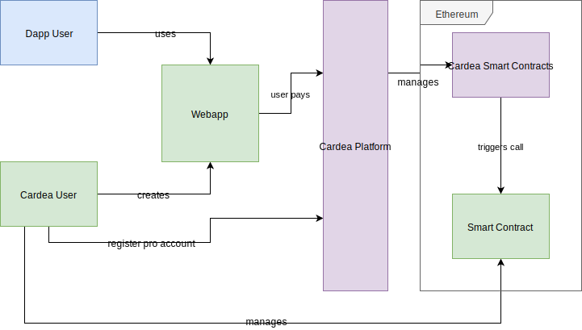
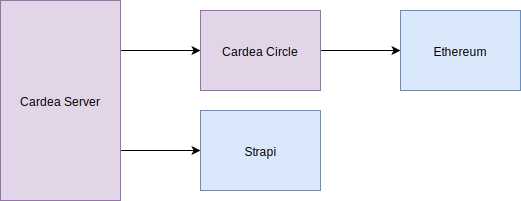
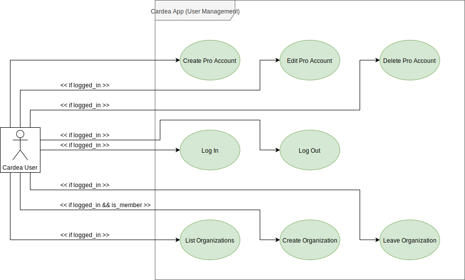
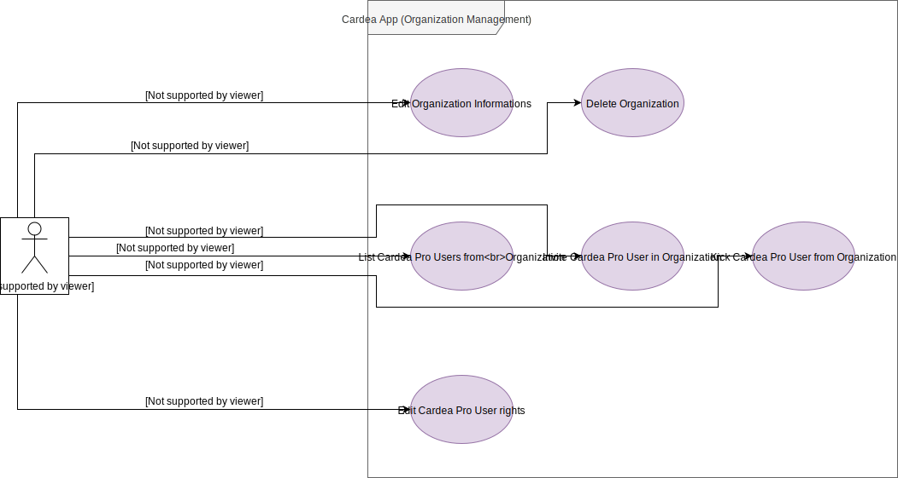
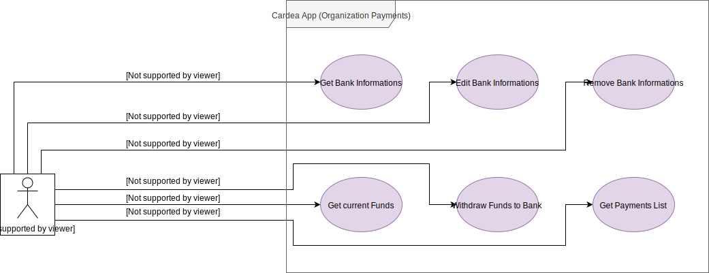
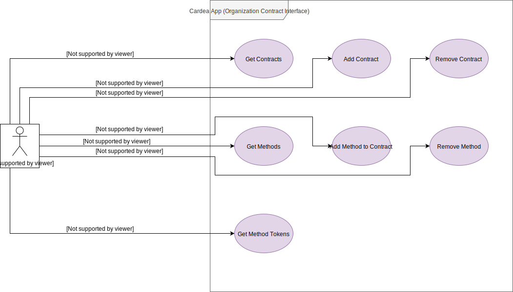
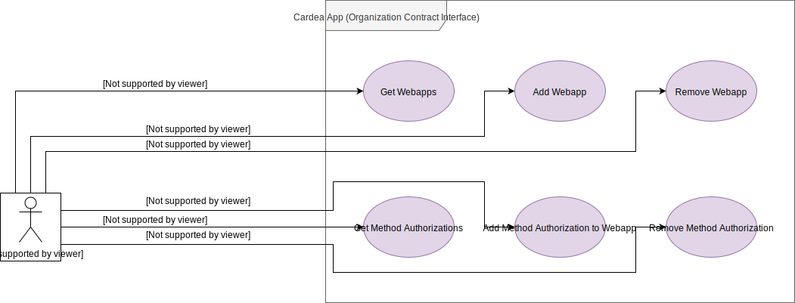
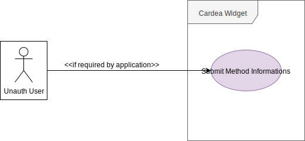
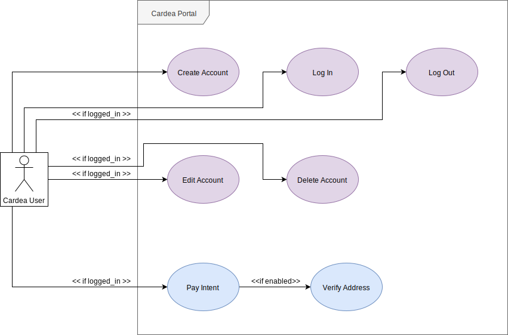
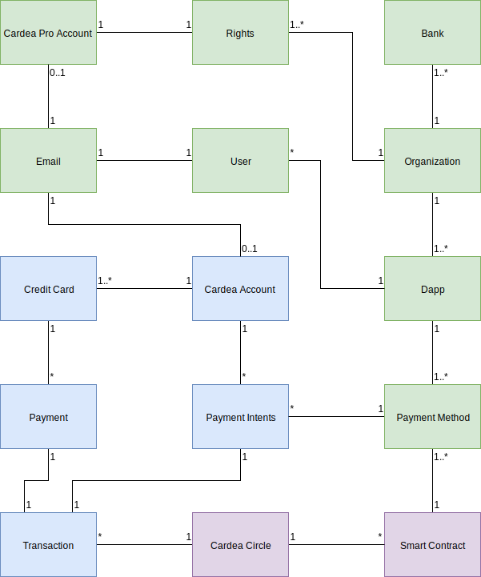

# Software Requirements Specification

## Cardea

| Version | Prepared By | Email |
| :---:   | :---:       | :---: |
| 1.1 | Iulian Rotaru | iulian.rotaru@ticket721.com |

## Document History

| Version | Date | Description | Author |
| :---:   | :---: | :---:      | :---:  |
| 1.0 | 14/07/2019 | Initial Documentation | Iulian Rotaru |
| 1.1 | 19/07/2019 | User Types Clarifications | Iulian Rotaru |

## Table of contents

1. [Introduction](#1_introduction)
   1. [Purpose](#1_1_purpose)
   2. [Scope](#1_2_scope)
   3. [Definitions, acronyms and abbreviations](#1_3_definitions)
   4. [References](#1_4_references)
2. [Overall description](#2_overall_description)
   1. [Product perspective](#2_1_product_perspective)
   2. [Product functions](#2_2_product_functions)
   3. [User characteristics](#2_3_user_characteristics)
   4. [Constraints](#2_4_constraints)
   5. [Assumptions and dependencies](#2_5_assumptions)
3. [Specific requirements](#3_specific_requirements)
   1. [Functional requirements](#3_1_functional_requirements)
      1. [Actor goal list](#3_1_1_actor_goal_list)
      2. [Use case view](#3_1_2_use_case_view)
   2. [Non-functional requirements](#3_2_non_functional_requirements)
      1. [Performance efficiency](#3_2_1_performance)
      2. [Compatibility](#3_2_2_compatibility)
      3. [Usability](#3_2_3_usability)
      4. [Reliability](#3_2_4_reliability)
      5. [Security](#3_2_5_security)
      6. [Maintainability](#3_2_6_maintainability)
      7. [Portability](#3_2_7_portability)
      8. [Design constraints](#3_2_8_design_constraints)
   3. [External interfaces](#3_3_external_interfaces)
4. [Analysis models](#4_analysis_model)

# 1. Introduction

This document will provide an overview of the Cardea Platform.

## 1.1. Purpose

An abstract description of the Cardea Platform is required as a communication and coordination mean between the technical and non-technical teams. This overview provides enough informations for one to understand the Platform and its functions without a deep technical knowledge.

## 1.2. Scope

This document is accessible by all the Cardea team. Only technical and product team members might edit its content. The document can be shared to outside parties only under non-divulgation agreement.

## 1.3. Definitions, acronyms and abbreviations

| Abbreviation | Description |
| :---:        | :---:       |
| `sdk`        | `software development kit` |
| `api`        | `application public inteface` |
| `Cardea User` | User with Regular Account on the platform (can make payments, cannot join or create Organizations) |
| `Cardea Pro User` | User with Pro Account on the platform (cannot make payments, can koin or create Organizations) |
| `Unauthenticated User` | User not logged in the Cardea Platform |
| `Dapp` | Decentralized Application (in our case, using the Ethereum Virtual Machine) |

# 2. Overall description

    
     
    <i>Figure 1. Cardea Platform simplified overview</i>

## 2.1. Product perspective

    
     
    <i>Figure 2. Cardea alien system dependencies</i>

The **Cardea Server** handles all requests from both Cardea users and Dapp users.

The **Cardea App** is the web application for Cardea users to communicate with the server, create organization, edit informations ...

The **Cardea Portal** recovers payment informations from the dapp user and communicates with the Cardea Server in order to start the transaction process.

The **Cardea Widget** integrates into a web application and eases the starting point of the whole transaction process.

The **Cardea Circle** is composed of whilelisted ethereum accounts that should never be accessible even by Cardea members. It submits transaction requests on Ethereum and should always have enough gas in order to work.

The **Cardea Contracts** are a set of smart contracts on the Ethereum blockchain used to translate credit card payments into Ethereum transactions.

Together, they form the **Cardea Platform**.

## 2.2. Product Functions

The product provides an infrastructure for businesses using the Ethereum Virtual Machine to host and run Smart Contracts and wanting to enable credit card payments for their users. The role of the platform is to properly handle user input, payment and informations in order to translate everything into an Ethereum transaction.

The product is perfectly suited for users not wanting to pay with cryptocurrencies for a payable Smart Contract method call, and could be a very good onboarding solution as it does not disable the possibility to use cryptocurrencies for the same actions. 

To make an example, imagine a contract selling tickets. This contract requires a specific amount of ether to buy this ticket. By implementing a Cardea compatible method, users can trigger the creation of the ticket by paying with their credit card. The funds go directly to the contract owner as fiat.

## 2.3. User Characteristics

Two types of services are offered

- **Regular Account** Services, allows the owner of the account to make payments with its credit card to trigger Ethereum Smart Contracts. This type of user is the **Cardea User**. It will most of the time be **Dapp Users**.

- **Pro Account** Services, allows the owner of the account to create and manage Organizations. An Organization can store Contracts, WebApps and Methods informations and can receive credit card payments. These users will most likely be **Dapp Owners**.

## 2.4. Constraints

To use the service in an application, the Cardea Pro User should create an Organization and fill some specific informations (Bank informations, Contract informations and WebApp informations).

Cardea Users cannot use the portal to make any call they would like, only Contracts and Methods registered on our platform can be called.

## 2.5. Assumption dependencies

Assuming the system might be under various types of load, it is designed to scale up and down efficiently to support pressure and reduce costs.

Assuming high number of transaction requests, Cardea Circle should be properly refilled with gas in order to operate all the transactions.

The platform is dependent on the following technologies:

| Name | Version | Description |
| :---: | :---: | :---: |

# 3. Specific requirements

This section contains all requirements in detail: Functional as well as non-functional
requirements (quality attributes and constraints). The quality attributes are listed according
to the ISO/IEC 25010 standard that classifies software quality in a structured set of
characteristics and sub-characteristics.

## 3.1. Functional Requirements

Functional requirements capture the intended behaviour of the Cardea Services.

### 3.1.1. Actor Goal List

The notation `Member(owner / admin)` would translate to `is a member with owner or admin rights`.

You can find three different actor:

- `Unauthenticated User` is someone on which we have no informations.
- `Cardea Pro User` is someone with a Pro Account, used to manage, create Organizations ...
- `Cardea User` is someone with a Regular Account, used to make payments

| Actor | Goal |
| :---: | :---: |
| Unauthenticated User | Create Pro Account |
| Cardea Pro User | Edit Pro Account |
| Cardea Pro User | Delete Pro Account |
| Unauthenticated User | Log In |
| Cardea Pro User | Log Out |
| Cardea Pro User | List Organizations |
| Cardea Pro User | Create Organizations |
| Cardea Pro User | Leave Organizations |
| Cardea Pro User + Member(`owner` / `admin`) | Edit Organization Informations |
| Cardea Pro User + Member(`owner`) | Delete Organization |
| Cardea Pro User + Member() | List Cardea Pro Users from Organization |
| Cardea Pro User + Member(`owner` / `admin`) | Invite Cardea Pro User in Organization |
| Cardea Pro User + Member(`owner` / `admin`) | Kick Cardea Pro User from Organization |
| Cardea Pro User + Member(`owner` / `admin`) | Edit Cardea Pro User Rights |
| Cardea Pro User + Member(`owner` / `admin` / `payment`) | Get Bank Informations |
| Cardea Pro User + Member(`owner` / `admin` / `payment`) | Edit Bank Informations |
| Cardea Pro User + Member(`owner` / `admin` / `payment`) | Remove Bank Informations |
| Cardea Pro User + Member(`owner` / `admin` / `payment`) | Get Current Funds |
| Cardea Pro User + Member(`owner` / `admin` / `payment`) | Withdraw Funds to Bank |
| Cardea Pro User + Member(`owner` / `admin` / `payment`) | Get Payments |
| Cardea Pro User + Member() | Get Contracts |
| Cardea Pro User + Member(`owner` / `admin` / `contract`) | Add Contract |
| Cardea Pro User + Member(`owner` / `admin` / `contract`) | Remove Contract |
| Cardea Pro User + Member() | Get Methods |
| Cardea Pro User + Member(`owner` / `admin` / `contract`) | Add Method to Contract |
| Cardea Pro User + Member(`owner` / `admin` / `contract`) | Remove Method from Contract |
| Cardea Pro User + Member() | Get Methods Token |
| Cardea Pro User + Member() | Get WebApps |
| Cardea Pro User + Member(`owner` / `admin` / `webapp`) | Add WebApp |
| Cardea Pro User + Member(`owner` / `admin` / `webapp`) | Remove WebApp |
| Cardea Pro User + Member() | Get Method Authorizations |
| Cardea Pro User + Member(`owner` / `admin` / `webapp`) | Add Method Authorization to WebApp |
| Cardea Pro User + Member(`owner` / `admin` / `webapp`) | Remove Method Authorization |
| Unauthenticated User | Submit Method Informations |
| Unauthenticated User | Create Regular Account |
| Unauthenticated User | Log In |
| Cardea User | Log Out |
| Cardea User | Edit Regular Account |
| Cardea User | Delete Regular Account |
| Cardea User | Pay Intent |
| Cardea User | Verify Address |

### 3.1.2. Use Case View

    
     
    <i>Figure 3. Cardea App Use Case (User Management) view</i>

 
 
 

    
     
    <i>Figure 4. Cardea App Use Case (Organization Management) view</i>

 
 
 

    
     
    <i>Figure 5. Cardea App Use Case (Organization Payments) view</i>

 
 
 

    
     
    <i>Figure 6. Cardea App Use Case (Organization Contract Interface) view</i>

 
 
 

    
     
    <i>Figure 7. Cardea App Use Case (Organization Webapp Interface) view</i>

 
 
 

    
     
    <i>Figure 8. Cardea Widget Use Case view</i>

 
 
 

    
     
    <i>Figure 9. Cardea Portal Use Case view</i>

### List of Use Cases

#### Cardea App (User Management) (CAUM)

|  | |
| :---: | :---: |
| Name | Create Pro Account |
| Code | `CAUM1` |
| Importance | Critical |
| Primary Actor | Unauthenticated User |
| Preconditions | User provides valid credentials |
| Postconditions | New pro account is created with given credentials |

|  | |
| :---: | :---: |
| Name | Edit Pro Account |
| Code | `CAUM2` |
| Importance | Critical |
| Primary Actor | Cardea Pro User |
| Preconditions | Cardea Pro User is logged in, Cardea Pro User provides valid account informations |
| Postconditions | Account informations are modified with new provided informations |

|  | |
| :---: | :---: |
| Name | Delete Pro Account |
| Code | `CAUM3` |
| Importance | Critical |
| Primary Actor | Cardea Pro User |
| Preconditions | Cardea Pro User is logged in, Cardea Pro User is not an owner of an Organization |
| Postconditions | Account and all informations are removed from the database |

|  | |
| :---: | :---: |
| Name | Log In |
| Code | `CAUM4` |
| Importance | Critical |
| Primary Actor | Unauthenticated User |
| Preconditions | Unauthenticated User is not logged in, Unauthenticated User provides valid credentials |
| Postconditions | A session token is generated and sent to the Unauthenticated User |

|  | |
| :---: | :---: |
| Name | Log Out |
| Code | `CAUM5` |
| Importance | Critical |
| Primary Actor | Cardea Pro User |
| Preconditions | Cardea Pro User is logged in |
| Postconditions | Current session token is unvalidated |

|  | |
| :---: | :---: |
| Name | List Organizations |
| Code | `CAUM6` |
| Importance | Critical |
| Primary Actor | Cardea Pro User |
| Preconditions | Cardea Pro User is logged in |
| Postconditions | A list with all Organizations where the Cardea Pro User is member is sent to the Cardea Pro User |

|  | |
| :---: | :---: |
| Name | Create Organization |
| Code | `CAUM7` |
| Importance | Critical |
| Primary Actor | Cardea Pro User |
| Preconditions | Cardea Pro User is logged in, valid Organization informations are provided |
| Postconditions | A new Organization is created, Cardea Pro User is member and has `owner` right |

|  | |
| :---: | :---: |
| Name | Leave Organization |
| Code | `CAUM8` |
| Importance | Critical |
| Primary Actor | Cardea Pro User |
| Preconditions | Cardea Pro User is logged in, Cardea Pro User is member of Organization, Cardea Pro User is not owner of Organization |
| Postconditions | Cardea Pro User is removed from the member list of target Organization |

#### Cardea App (Organization Management) (CAOM)

|  | |
| :---: | :---: |
| Name | Edit Organization Informations |
| Code | `CAOM1` |
| Importance | Critical |
| Primary Actor | Cardea Pro User |
| Preconditions | Cardea Pro User is logged in, Cardea Pro User is member of Organization, Cardea Pro User has `owner`, `admin` rights, valid Organization informations are provided |
| Postconditions | Organization informations are modified |

|  | |
| :---: | :---: |
| Name | Delete Organization |
| Code | `CAOM2` |
| Importance | Critical |
| Primary Actor | Cardea Pro User |
| Preconditions | Cardea Pro User is logged in, Cardea Pro User is member of Organization, Cardea Pro User has `owner` rights, Organization's balance is 0 |
| Postconditions | Organization is deleted |

|  | |
| :---: | :---: |
| Name | List Cardea Pro Users from Organization |
| Code | `CAOM3` |
| Importance | Critical |
| Primary Actor | Cardea Pro User |
| Preconditions | Cardea Pro User is logged in, Cardea Pro User is member of Organization |
| Postconditions | A list of the Organization's members is sent to the Cardea Pro User |

|  | |
| :---: | :---: |
| Name | Invite Cardea Pro User in Organization |
| Code | `CAOM4` |
| Importance | Critical |
| Primary Actor | Cardea Pro User |
| Preconditions | Cardea Pro User is logged in, Cardea Pro User is member of organization, Cardea Pro User has `owner` or `admin` rights, Target Cardea Pro User is not already a member of the Organization |
| Postconditions | Target Cardea Pro User is added to the Organization |

|  | |
| :---: | :---: |
| Name | Kick Cardea Pro User from Organization |
| Code | `CAOM5` |
| Importance | Critical |
| Primary Actor | Cardea Pro User |
| Preconditions | Cardea Pro User is logged in, Cardea Pro User is member of Organization, Cardea Pro User has `owner` or `admin` rights, Target Cardea Pro User is a member of Organization. If Target Cardea Pro User has `admin` rights, `owner` right is required. Cardea Pro User with `owner` rights cannot be kicked. |
| Postconditions | Target Cardea Pro User is removed from the Organization |

|  | |
| :---: | :---: |
| Name | Edit Cardea Pro User Rights |
| Code | `CAOM6` |
| Importance | Critical |
| Primary Actor | Cardea Pro User |
| Preconditions | Cardea Pro User is logged in, Cardea Pro User is member of Organization, Cardea Pro User has `owner` or `admin` rights, Target Cardea Pro User is a member of Organization. Only `owner` can set `admin` rights. Only `owner` can change current `owner` |
| Postconditions | Target Cardea Pro User's rights are modified |

#### Cardea App (Organization Payments) (CAOP)

|  | |
| :---: | :---: |
| Name | Get Bank Informations |
| Code | `CAOP1` |
| Importance | Critical |
| Primary Actor | Cardea Pro User |
| Preconditions | Cardea Pro User is logged in, Cardea Pro User is member of organization, Cardea Pro User has `owner`, `admin` or `payment` rights |
| Postconditions | Bank informations are sent to the Cardea Pro User |

|  | |
| :---: | :---: |
| Name | Edit Bank Informations |
| Code | `CAOP2` |
| Importance | Critical |
| Primary Actor | Cardea Pro User |
| Preconditions | Cardea Pro User is logged in, Cardea Pro User is member of Organization, Cardea Pro User has `owner`, `admin` or `payment` rights, valid Bank Informations are provided |
| Postconditions | Bank Informations are modified |

|  | |
| :---: | :---: |
| Name | Remove Bank Informations |
| Code | `CAOP3` |
| Importance | Critical |
| Primary Actor | Cardea Pro User |
| Preconditions | Cardea Pro User is logged in, Cardea Pro User is member of organization, Cardea Pro User has `owner`, `admin` or `payment` rights |
| Postconditions | Bank Informations are removed |

|  | |
| :---: | :---: |
| Name | Get Current Funds |
| Code | `CAOP4` |
| Importance | Critical |
| Primary Actor | Cardea Pro User |
| Preconditions | Cardea Pro User is logged in, Cardea Pro User is member of Organization, Cardea pro User has `owner`, `admin` or `payment` rights |
| Postconditions | Organization current balance value is sent to the Cardea Pro User |

|  | |
| :---: | :---: |
| Name | Withdraw Funds to Bank |
| Code | `CAOP5` |
| Importance | Critical |
| Primary Actor | Cardea Pro User |
| Preconditions | Cardea Pro User is logged in, Cardea Pro User is member of Organization, Cardea Pro User has `owner`, `admin` or `payment` rights |
| Postconditions | Process to send funds to Bank account is started |

|  | |
| :---: | :---: |
| Name | Get Payments |
| Code | `CAOP6` |
| Importance | Critical |
| Primary Actor | Cardea Pro User |
| Preconditions | Cardea Pro User is logged in, Cardea Pro User is member of organization, Cardea Pro User has `owner`, `admin` or `payment` rights |
| Postconditions | A list of payments made to the organization is sent to the Cardea Pro User |

#### Cardea App (Organization Contract Interface) (CAOCI)

|  | |
| :---: | :---: |
| Name | Get Contracts |
| Code | `CAOCI1` |
| Importance | Critical |
| Primary Actor | Cardea Pro User |
| Preconditions | Cardea Pro User is logged in, Cardea Pro User is member of Organization |
| Postconditions | A list of the smart contracts used by the Organization is sent to the Cardea Pro User |

|  | |
| :---: | :---: |
| Name | Add Contract |
| Code | `CAOCI2` |
| Importance | Critical |
| Primary Actor | Cardea Pro User |
| Preconditions | Cardea Pro User is logged in, Cardea Pro User is member of Organization, Cardea Pro User has `owner`, `admin` or `contracts` rights, valid Contract informations are provided |
| Postconditions | The provided contract is added to the Organization |

|  | |
| :---: | :---: |
| Name | Remove Contract |
| Code | `CAOCI3` |
| Importance | Critical |
| Primary Actor | Cardea Pro User |
| Preconditions | Cardea Pro User is logged in, Cardea Pro User is member of Organization, Cardea Pro User has `owner`, `admin` or `contracts` rights, Contract is linked to the Organization |
| Postconditions | The provided Contract is removed from the Organization |

|  | |
| :---: | :---: |
| Name | Get Methods |
| Code | `CAOCI4` |
| Importance | Critical |
| Primary Actor | Cardea Pro User |
| Preconditions | Cardea Pro User is logged in, Cardea Pro User is member of Organization |
| Postconditions | Contract methods added to the Organization are sent to the Cardea Pro User |

|  | |
| :---: | :---: |
| Name | Add Method to Contract |
| Code | `CAOCI5` |
| Importance | Critical |
| Primary Actor | Cardea Pro User |
| Preconditions | Cardea Pro User is logged in, Cardea Pro User is member of Organization, Cardea Pro User has `owner`, `admin` or `contracts` rights, Contract is linked to Organization, Method is valid |
| Postconditions | Provided Method is added to the target Contract |

|  | |
| :---: | :---: |
| Name | Remove Method from Contract |
| Code | `CAOCI6` |
| Importance | Critical |
| Primary Actor | Cardea Pro User |
| Preconditions | Cardea Pro User is logged in, Cardea Pro User is member of Organization, Cardea Pro User has `owner`, `admin` or `contracts` rights, Contract is linked to Organization, Method is linked to Contract |
| Postconditions | Provided Method is removed from the target Contract |

|  | |
| :---: | :---: |
| Name | Get Method Tokens |
| Code | `CAOCI7` |
| Importance | Critical |
| Primary Actor | Cardea Pro User |
| Preconditions | Cardea Pro User is logged in, Cardea Pro User is member of Organization |
| Postconditions | All Tokens from all Methods from all Contracts of the Organization are sent to the Cardea Pro User |

#### Cardea App (Organization Webapp Interface) (CAOWI)

|  | |
| :---: | :---: |
| Name | Get WebApps |
| Code | `CAOWI1` |
| Importance | Critical |
| Primary Actor | Cardea Pro User |
| Preconditions | Cardea Pro User is logged in, Cardea Pro User is member of Organization |
| Postconditions | All WebApps linked to the Organization are sent to the Cardea Pro User |
 
|  | |
| :---: | :---: |
| Name | Add WebApp |
| Code | `CAOWI2` |
| Importance | Critical |
| Primary Actor | Cardea Pro User |
| Preconditions | Cardea Pro User is logged in, Cardea Pro User is member of Organization, Cardea Pro User has `owner`, `admin` or `webapp` rights, valid WebApp informations are provided |
| Postconditions | New WebApp is added to the Organization |

|  | |
| :---: | :---: |
| Name | Remove WebApp |
| Code | `CAOWI3` |
| Importance | Critical |
| Primary Actor | Cardea Pro User |
| Preconditions | Cardea Pro User is logged in, Cardea Pro User is member of Organization, Cardea Pro User has `owner`, `admin` or `webapp` rights, WebApp is linked to Organization |
| Postconditions | Provided WebApp is removed from Organization |

|  | |
| :---: | :---: |
| Name | Get Method Authorizations |
| Code | `CAOWI4` |
| Importance | Critical |
| Primary Actor | Cardea Pro User |
| Preconditions | Cardea Pro User is logged in, Cardea Pro User is member of Organization |
| Postconditions | All Method Authorizations for all WebApps are sent to the Cardea Pro User |

|  | |
| :---: | :---: |
| Name | Add Method Authorization to WebApp |
| Code | `CAOWI5` |
| Importance | Critical |
| Primary Actor | Cardea Pro User |
| Preconditions | Cardea Pro User is logged in, Cardea Pro User is member of Organization, Cardea Pro User has `owner`, `admin`, or `webapp` rights, valid Method is provided, valid WebApp is provided |
| Postconditions | Method Authorization is added to the WebApp |

|  | |
| :---: | :---: |
| Name | Remove Method Authorization |
| Code | `CAOWI6` |
| Importance | Critical |
| Primary Actor | Cardea Pro User |
| Preconditions | Cardea Pro User is logged in, Cardea Pro User is member of Organization, Cardea Pro User has `owner`, `admin`, or `webapp` rights, Method Authorization exists |
| Postconditions | Method Authorization is removed from the WebApp |

#### Cardea Widget (CW)

|  | |
| :---: | :---: |
| Name | Submit Method Informations |
| Code | `CACW1` |
| Importance | Critical |
| Primary Actor | Unauthenticated User |
| Preconditions | Method informations are provided (if required), Payment informations are provided (if required) |
| Postconditions | Payment Intent is created, Unauthenticated User is redirected to Cardea Portal with generated Payment Intent |

#### Cardea Portal (CP)

|  | |
| :---: | :---: |
| Name | Create Regular Account |
| Code | `CACP1` |
| Importance | Critical |
| Primary Actor | Unauthenticated User |
| Preconditions | Provided crendentials are valid |
| Postconditions | Account is created |

|  | |
| :---: | :---: |
| Name | Log In |
| Code | `CACP2` |
| Importance | Critical |
| Primary Actor | Unauthenticated User |
| Preconditions | Unauthenticated User is not logged in, Unauthenticated User provides valid credentials |
| Postconditions | A session token is generated and sent to the Unauthenticated User |

|  | |
| :---: | :---: |
| Name | Log Out |
| Code | `CACP3` |
| Importance | Critical |
| Primary Actor | Cardea User |
| Preconditions | Cardea User is logged in |
| Postconditions | Current session token is unvalidated |

|  | |
| :---: | :---: |
| Name | Edit Regular Account |
| Code | `CACP4` |
| Importance | Critical |
| Primary Actor | Cardea User |
| Preconditions | Cardea User is logged in, Cardea User provides valid account informations |
| Postconditions | Account informations are modified with new provided informations |

|  | |
| :---: | :---: |
| Name | Delete Regular Account |
| Code | `CACP5` |
| Importance | Critical |
| Primary Actor | Cardea User |
| Preconditions | Cardea User is logged in |
| Postconditions | Account and all informations are removed from the database |

|  | |
| :---: | :---: |
| Name | Pay Intent |
| Code | `CACP6` |
| Importance | Critical |
| Primary Actor | Cardea User |
| Preconditions | Cardea User is logged in, valid Payment Intent is provided, Valid payment is made |
| Postconditions | Starts Resolution of Payment Intent Process and Ethereum Transaction Process |

|  | |
| :---: | :---: |
| Name | Verify Address |
| Code | `CACP7` |
| Importance | Critical |
| Primary Actor | Cardea User |
| Preconditions | Cardea User is logged in, feature is required or enabled during `CACP6` |
| Postconditions | Adds the current payment solution hash to the Ethereum Address of the account |

## 3.2. Non-Functional Requirements

### 3.2.1. Performance efficiency

Cardea Widget should be lightweight and should not impact performance of integrated website.

### 3.2.2. Compatibility

The service requires Smart Contracts to implement specific entry points methods to trigger mechanisms.

### 3.2.3. Usability

Cardea App should be usable on desktop and mobile web browsers.
Cardea Widget should work on desktop and mobile web browsers.

### 3.2.4. Reliability

Transactions should eventually proceed even if browser is closed. Cardea Server should handles large amounts of requests.

### 3.2.5. Security

User informations should be kept in a secure data storage solution.
Credit Card informations should not be stored.
Cardea Portal, Cardea App, Cardea Server should communicate in an encrypted manner.

### 3.3.6. Portability

Cardea Widget should work for VanillaJs / React websites.

### 3.2.7. Design Constraints

Cardea Server should be built in a microservice fashion, allowing easier integration in scaling solutions.

## 3.3. External interfaces

### Graphical External Interfaces

- **Cardea App** is a web application for the **Cardea Pro Users**, used to manage organizations, register applications and contracts and withdraw funds.
- **Cardea Widget** is a simple web component that creates a payment intent from a web application, and redirects the user on the **Cardea Portal** to proceed with payment.
- **Cardea Portal** is a web page that manages the credit card payment of the **Cardea User**

### Non-graphical Interfaces

- **Cardea Server** exposes an `api` used by the **Cardea App**, **Cardea Widget** and **Cardea Portal**.
- **Cardea Contracts** exposes read-only methods and helpers.

# 4. Analysis Model

    
     
    <i>Figure 10. Domain Model</i>

